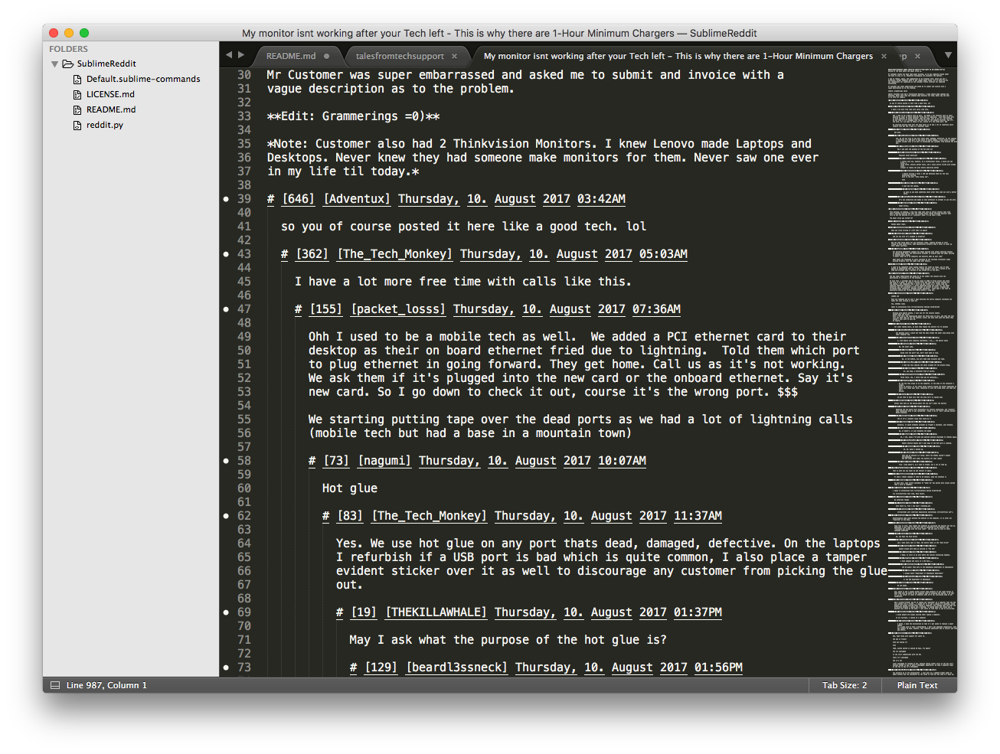

# SublimeReddit

This is a Sublime Text plugin that allows you to browse reddit in an editor
window. Pretty useful if you have a boring job where nobody cares about you or
what you do. Look busy, read internets, get paid.

It's really only useful for text-based subreddits. I like using it to read
talesfromtechsupport and nosleep. I'm sure you'll find your own favourites!

I also don't really know python. I managed to muddle this thing together over
a couple of afternoons, but I apologise if it's written poorly.

## Video

[Demo video](https://www.youtube.com/watch?v=xiOGEmT_7W8)

## Goals

I want to make sure that this plugin cooperates nicely with the editor. I like
using multiple cursors to do things, so in any case where that's reasonable,
I'd like to use that.

I want this thing to remain boring. It should look like I'm frustrated while
I'm using it, so nobody comes to bother me. To this end, I'm perfectly happy
having slow loading times or blocking i/o when fetching data.

## Command: Browse subreddit

You can highlight the name of a subreddit and use the
`reddit_browse_subreddit` command (accessible via your command palette as
"Reddit: Browse subreddit") to browse the threads on the front page of that
subreddit.

Posts are displayed with their ID, title, and score, in the default sort
order. Their text content is also included. This makes it really easy to
browse subreddits that are mostly self posts.

## Command: View thread

You can highlight the ID of a thread and use the `reddit_view_thread` command
(accessible via your command palette as "Reddit: View thread") to browse a
whole comment thread. There's currently no functionality to expand threads
past the default nesting limit.

Comments are indented so you can use sublime's built in folding to collapse
them.

## License

BSD, three-clause.
